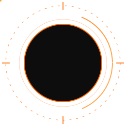

<div align="center">


<p>
<b>PHYSICAL AI &nbsp;::&nbsp; AUTONOMOUS HARDWARE &nbsp;::&nbsp; OPEN-SOURCE ADVOCATE</b>
</p>


<br/><br/>



</div>

<br/>


<br/>

<table width="100%">
<tr><td>

```
┌──[ SYS_LOG :: BOOT_SEQUENCE_INITIATED ]───────────────────────────────────┐
│ [OK] LOADING OPERATOR_PROFILE ......................... DONE            │
│ OPERATOR   : Miguel Maximos Ramos Rodrigues                              │
│ CALLSIGN   : gardenermaximos                                             │
│ ROLE       : Mechanical Lead // Hardware Engineer                        │
│ FOCUS      : Physical AI :: Embedded Systems :: Mobile Robotics          │
│ EXPERIENCE : 5+ yrs // CAD Modeling // Fabrication // Kinematic Control  │
│ LOCATION   : Ourinhos, SP - Brazil                                       │
│ [OK] SYSTEM_BIO_LOADED ................................ [STATUS_ONLINE] │
└────────────────────────────────────────────────────────────────────────┘
```

</td></tr>
</table>


## /// SYSTEM_BIO :: OPERATOR_OVERVIEW

Mechanical Lead and Hardware Engineer driven by building physical systems that operate reliably in the real world. Rooted in mechanical design, automation, and control systems, with 5+ years of hands-on experience across CAD modeling, physical fabrication, and mobile robotics — focused on Physical AI and low-latency embedded hardware.

<div align="center">

| `[ID]` | MODULE | METRICS |
|:---:|:---|:---|
| `[01]` | **HARDWARE_ARCHITECTURE** :: RoboCup | 300+ 3D models designed \| 100+ custom fabricated parts \| 6 autonomous soccer robots (Lightweight & Infrared) |
| `[02]` | **ALGORITHMIC_EFFICIENCY** :: Research | Taylor Series & Silver Ratio approximations replacing sqrt ops on microcontrollers |
| `[03]` | **OPEN_SOURCE_HARDWARE** :: Publishing | Production-ready CAD + docs standardized for 9+ BR robotics teams |
| `[04]` | **STEM_MENTORSHIP** :: StemPlan | Founder \| 64+ students mentored \| 1 trainee promoted to competitive squad |

</div>


## /// COMPETITION_LOG :: VERIFIED_RESULTS

<div align="center">

| `[RANK]` | EVENT | RESULT |
|:---:|:---|:---|
| `[>>]` | RoboCup International — Incheon 2026 | **Top 6 / 24** teams worldwide |
| `[>>]` | RoboCup Brazil — National Championship 2025 | **1st / 6** national teams |
| `[>>]` | State Championship 2026 | **1st / 8** state teams (x2 titles) |
| `[>>]` | State Championship 2025 | **3rd / 8** state teams (x2 podiums) |

`[LOG]` Team trajectory: last place in regional qualifiers &rarr; National Champion &rarr; Top 6 global &rarr; 4 new teams incubated (1 state title).

</div>


## /// SYSTEM_CAPABILITY_GAUGES

```
CAD & MECHANICAL DESIGN     ██████████████████░░  90%
PHYSICAL FABRICATION        ██████████████████░░  90%
EMBEDDED C / C++            ████████████████░░░░  80%
PYTHON                      ████████████████░░░░  80%
APPLIED MATH / RESEARCH     ██████████████████░░  90%
```


## /// HARDWARE_&_SOFTWARE_MATRIX :: TECH_STACK

<div align="center">

**[ 01 ] CAD & PHYSICAL PROTOTYPING**
<br/>


<br/><br/>

**[ 02 ] EMBEDDED & COMPUTING**
<br/>


<br/><br/>

**[ 03 ] ENGINEERING WORKFLOW**
<br/>


</div>


## /// FEATURED_MISSION_MODULES :: REPOSITORIES

<table width="100%">
<tr>
<td width="50%">
<a href="https://github.com/gardenermaximos/RoboCup-Hardware-OpenSource">

</a>
</td>
<td width="50%">
<a href="https://github.com/gardenermaximos/Taylor-Series-Hypotenuse-Approximation">

</a>
</td>
</tr>
<tr>
<td width="50%">
<a href="https://github.com/gardenermaximos/NeuroPulse-Industrial-Safety">

</a>
</td>
<td width="50%">
<a href="https://github.com/gardenermaximos/StemPlan-Robotics-Curriculum">

</a>
</td>
</tr>
</table>


## /// CURRENT_OBJECTIVES :: TERMINAL_LOGS

```bash
[+] CURRENT_LOCATION : Ourinhos, SP - Brazil
[+] TARGET_DEGREE    : Mechanical Engineering
[+] CURRENT_FOCUS    : Closed-loop biometrics & physical AI embedded control
[+] ACTIVE_PROJECTS  : NeuroPulse (Biomedical Wearable) // RoboCup Open Hardware
[+] RESEARCH_THREAD  : Taylor Series / Silver Ratio sqrt-free hypotenuse approximation
[>] SYSTEM_LOG       : "Atoms are harder than bits, but that's where the future lives."
[OK] DIRECTIVES_LOADED ................................. [STATUS_ONLINE]
```


## /// SYSTEM_METRICS_&_ANALYTICS :: TELEMETRY

<div align="center">


<br/><br/>


<br/><br/>


<br/><br/>


</div>


## /// CONTRIBUTION_MATRIX :: SNAKE_ANIMATION

<div align="center">

<picture>
  <source media="(prefers-color-scheme: dark)" srcset="https://raw.githubusercontent.com/gardenermaximos/gardenermaximos/output/github-contribution-grid-snake-dark.svg" />
  <source media="(prefers-color-scheme: light)" srcset="https://raw.githubusercontent.com/gardenermaximos/gardenermaximos/output/github-contribution-grid-snake.svg" />
  
</picture>

</div>


## /// PORTFOLIO_NODES :: VAULT_&_CONNECT

<div align="center">

<a href="https://www.printables.com/@MiguelMaximo_5247862">

</a>
<a href="https://makerworld.com/@MiguelMaximoss">

</a>
<a href="#">

</a>

</div>

<br/>

<div align="center">


```
[ID] OPERATOR :: gardenermaximos // Miguel Maximos Ramos Rodrigues
[COPYRIGHT] (c) 2026 :: ALL_SYSTEMS_AUTHORED_IN_BRAZIL
[STATUS] ................................ [ONLINE] :: [MONITORING_ACTIVE]
```

</div>
[](LINK_DO_SEU_LINKEDIN)

---
**"Atoms are harder than bits, but that's where the future lives."**
